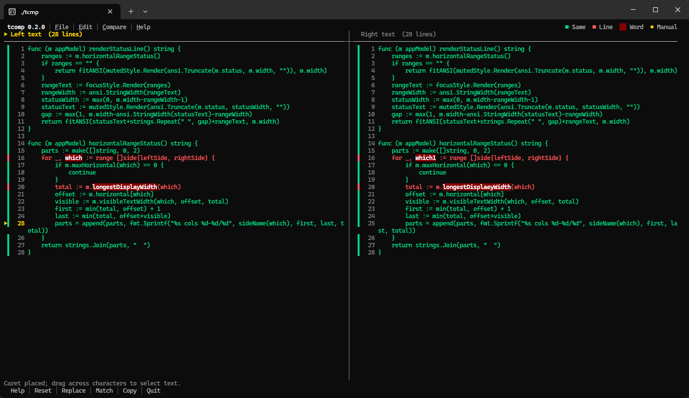

# tcomp

[English](README.md) | [简体中文](README.zh-CN.md)

[](https://github.com/gmodx/tcmp/actions/workflows/release.yml)
[](https://go.dev/)

`tcomp` is a mouse-first, editable text comparison TUI for the terminal. It displays two documents side by side, updates line and word differences while you type, supports manual line matching, and works with pasted text or UTF-8 files.



## Highlights

- Side-by-side editing with independent line numbers and synchronized vertical scrolling.
- Green identical lines, red changed/inserted/deleted lines, and dark-red changed words.
- Mouse text selection with Copy, Cut, Paste, and an OSC 52 terminal clipboard bridge.
- Right-click manual line matching for cases where automatic alignment needs guidance.
- A draggable center divider, default-on long-line wrapping (toggle it from **Edit**), optional independent horizontal scrolling, a blinking caret, menus, and a command bar.
- Keyboard access for every important action without relying on function keys.
- Versioned release archives for Linux, macOS, and Windows.

## Install

### Download a release

Download the archive for your platform from [GitHub Releases](https://github.com/gmodx/tcmp/releases), extract it, and put `tcomp` (or `tcomp.exe`) on your `PATH`.

| Operating system | Architectures | Archive |
|---|---|---|
| Linux | amd64, arm64, 386 | `.tar.gz` |
| macOS | amd64 (Intel), arm64 (Apple Silicon) | `.tar.gz` |
| Windows | amd64, arm64 | `.zip` |

Example for Linux amd64, using version `0.2.0`:

```sh
curl -LO https://github.com/gmodx/tcmp/releases/download/v0.2.0/tcomp_0.2.0_linux_amd64.tar.gz
tar -xzf tcomp_0.2.0_linux_amd64.tar.gz
install -m 0755 tcomp "$HOME/.local/bin/tcomp"
tcomp --version
```

Each release includes `checksums.txt`. Verify an archive before extracting it:

```sh
sha256sum --check checksums.txt
```

### Install with Go

```sh
go install github.com/gmodx/tcmp@latest
```

Go 1.22 or newer is required.

### Build from source

```sh
git clone https://github.com/gmodx/tcmp.git
cd tcomp
go build -o tcomp .
./tcomp --version
```

## Run

```sh
tcomp
tcomp left.txt
tcomp left.txt right.txt
tcomp --version
tcomp --help
```

Both file arguments are optional. Input files must be valid UTF-8; a UTF-8 BOM is accepted. With one file, the right pane starts empty. Without file arguments, `tcomp` restores the left and right text from the previous session when a cache exists; the first run starts with two empty panes. Passing either file argument bypasses cached input, so old text never overrides an explicitly opened file.

On exit, both panes are saved to `tcomp/last-session.json` under the operating system's user cache directory (`$XDG_CACHE_HOME` or `~/.cache` on most Linux systems, `~/Library/Caches` on macOS, and the local application-data cache on Windows). The cache contains plain text and can be removed at any time to return to an empty startup.

> [!IMPORTANT]
> `tcomp` does not write changes back to the input files. Edited text is retained only in the local session cache; use Copy or the terminal clipboard to save it somewhere else.

## Interface

The first row contains the `File`, `Edit`, `Compare`, and `Help` menus. **Edit → ✓ Wrap Line** is enabled by default: paired rows expand to keep both panes aligned. Turn it off to keep each row to one screen line and use horizontal scrolling. The color legend stays at the upper-right. The bottom row provides clickable `Help`, `Reset`, `Replace`, `Match`, `Copy`, and `Quit` commands, with status messages directly above it.

| Indicator | Meaning |
|---|---|
| Green line / gutter bar | Identical content |
| Red line / gutter bar | Changed, inserted, or deleted content |
| Dark-red background | Changed word or token |
| Yellow `◆` | Manual line match |
| Yellow `●` | Line picked for manual matching |
| `▶` | Current aligned row |
| Blinking yellow `▏` | Text caret |
| `‹` / `›` at a text edge | More content exists to the left / right |
| `Left cols …` / `Right cols …` in the status row | Visible display-column range for long lines |

Control characters are shown as visible escapes such as `\x1B`, so file content cannot inject terminal control sequences into the display.

## Mouse controls

Mouse interaction is the primary workflow:

- Left-click text to place the caret; type immediately. There is no edit-mode switch.
- Left-drag to select characters across one or more lines.
- Right-click inside selected text to Copy, Cut, Paste, or cancel.
- Right-click outside a text selection to pick a source line and open the manual-match menu. Pick a line on each side, then choose **Match selected line pair**.
- Drag the center divider to resize the panes. Each pane keeps a minimum usable width.
- Use the normal wheel to scroll both panes vertically.
- With **Edit → Wrap Line** disabled, use a horizontal wheel to scroll only the pane under the pointer. If the terminal has no horizontal wheel events, hold `Shift` while using the normal wheel. `‹` and `›` show hidden content, and the status row reports each pane's visible column range.
- Click the top menus or bottom command bar for common actions.

When terminal mouse tracking is active, hold `Shift` while dragging if you want the terminal emulator's native selection instead of `tcomp`'s text selection.

## Editing and clipboard

Editing is always active. Printable characters insert at the caret; Enter creates a line; Backspace and Delete remove text. Arrow keys move by one character or line, Home and End move to the current line's edges, Page Up and Page Down move by one viewport, and Ctrl+Home and Ctrl+End move to the document's beginning or end. Typing or pasting replaces an active selection. On a long line, moving or editing automatically scrolls the focused pane to keep the caret visible.

`Ctrl+C` exits `tcomp`. Use **Edit → Copy selection** or the selected-text context menu to copy to `tcomp`'s internal clipboard and emit OSC 52 for terminals that permit system-clipboard writes. `Ctrl+X` cuts and copies, while `Ctrl+V` reads the internal clipboard. Terminal programs cannot portably read the system clipboard, so paste external text with the terminal's `Shift+Insert`, `Ctrl+Shift+V`, or paste-menu command.

Press `Ctrl+P` or click **Replace** to replace one complete document. Paste or type into the preview, press `Ctrl+S` to apply it, or press Esc to cancel.

## Shortcuts

| Input | Action |
|---|---|
| Left-click / left-drag | Place caret / select text |
| Right-click selected text | Clipboard context menu |
| Right-click other text | Manual line-match menu |
| Drag center divider | Resize panes |
| Mouse wheel | Synchronized vertical scroll |
| Horizontal wheel / Shift+wheel | Horizontal scroll in the pane under the pointer |
| Printable text | Insert text or replace selection |
| Enter | Insert a new line |
| Backspace / Delete | Remove text or selection |
| Arrow keys | Move the caret by one character or line |
| Home / End | Move to the start / end of the current line |
| Page Up / Page Down | Move by one viewport |
| Ctrl+Home / Ctrl+End | Move to the beginning / end of the document |
| Tab / Shift+Tab | Switch focused pane |
| Ctrl+A | Select the focused document |
| Ctrl+X / Ctrl+V | Cut / internal Paste |
| Copy selection | Edit menu or selected-text context menu |
| Shift+Insert or Ctrl+Shift+V | Paste external text at the caret or over selection |
| Ctrl+P | Open complete-document replacement |
| Ctrl+S | Apply complete-document replacement |
| Ctrl+R | Reset manual matches and selections |
| Alt+M | Match lines picked with right-click |
| Alt+F / Alt+E / Alt+C | Open File / Edit / Compare menu |
| Alt+H | Open Help |
| Esc | Close overlay or clear selections |
| Ctrl+C / Ctrl+Q | Quit |

## Comparison model

`tcomp` aligns exact lines with a longest common subsequence (LCS). Unmatched ranges are paired in order, with placeholders for insertions and deletions. Changed paired lines receive a token-level LCS so only changed words or punctuation get the dark-red background.

Manual matches are ordered anchors. A source line can belong to only one manual match, and anchors cannot cross. Normal line insertion moves unaffected anchors with their source text; ambiguous deletion or line merging removes affected anchors. Replacing a complete document clears manual matches.

## Release process

The workflow at [`.github/workflows/release.yml`](.github/workflows/release.yml) runs tests, the race detector, vet, formatting checks, and seven cross-platform builds. It embeds the tag version with Go linker flags, creates versioned archives, verifies the native Linux binary's version output, generates SHA-256 checksums, and publishes the assets.

Create a release by pushing a semantic version tag:

```sh
git tag v0.2.0
git push origin v0.2.0
```

Tags may include a prerelease suffix, such as `v0.3.0-rc.1`; the workflow marks those GitHub releases as prereleases. The workflow can also be run manually with a version input to build downloadable Actions artifacts without publishing a GitHub Release.

For a local versioned build:

```sh
go build -trimpath -ldflags "-s -w -X main.appVersion=0.2.0" -o tcomp .
./tcomp --version
```

## Development

```sh
gofmt -w *.go
go test ./...
go test -race ./...
go vet ./...
go build ./...
```

The comparison and workspace logic are independent of the terminal renderer. Tests cover alignment, word-level differences, manual-match validation, editing, paste behavior, clipboard actions, mouse selection, divider resizing, narrow-terminal help, Unicode width, control-character rendering, and CLI version reporting.

## Current limitations

- Changes cannot yet be saved directly to files.
- OSC 52 clipboard writes depend on terminal and multiplexer configuration.
- Mouse features require a terminal that forwards mouse events.
- The line-alignment algorithm uses LCS memory proportional to both document line counts, so very large files are outside the current design target.
